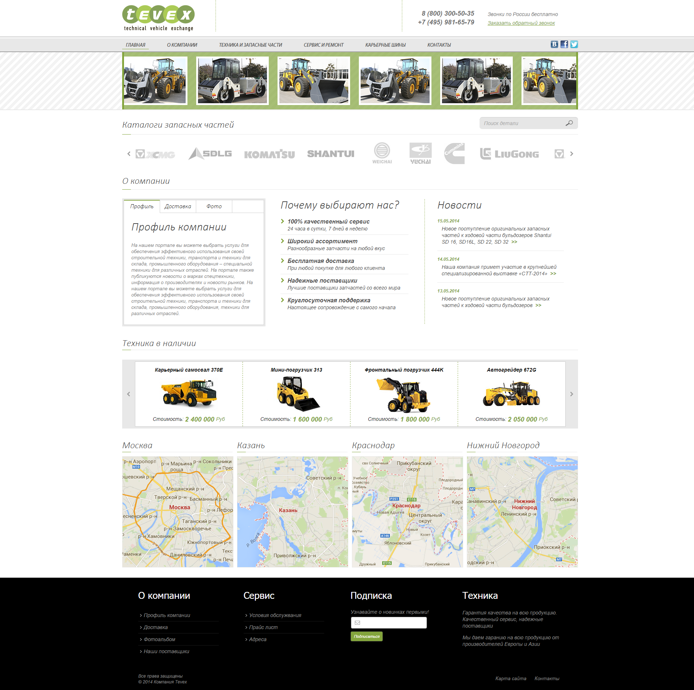
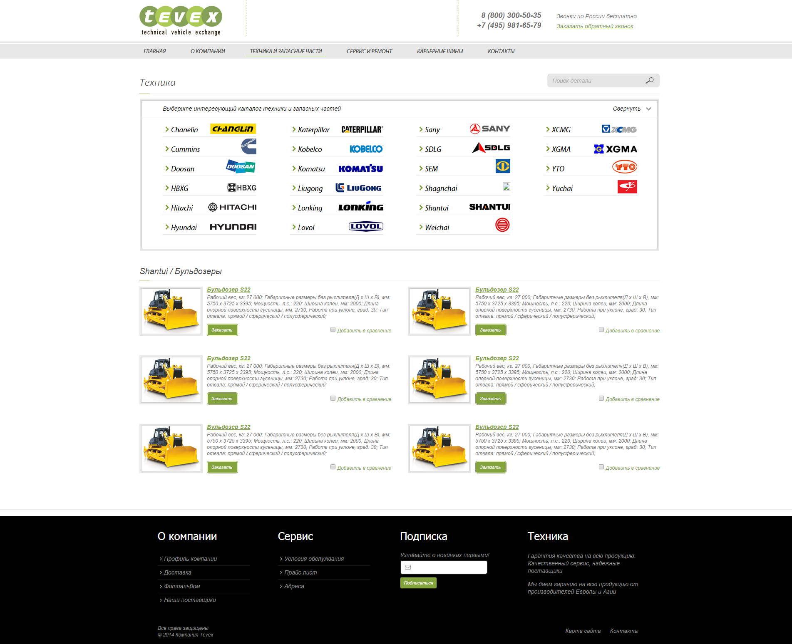
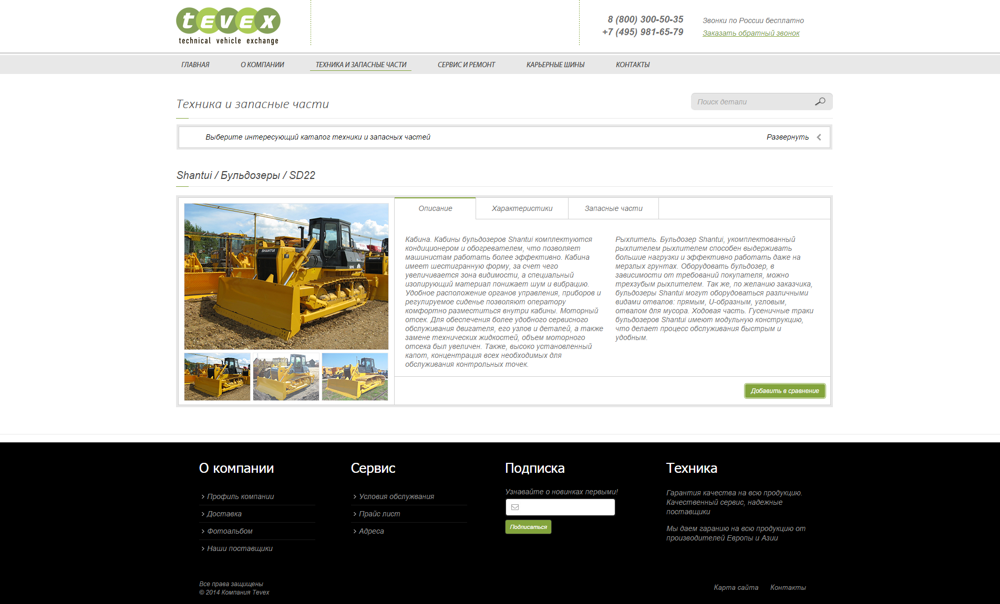
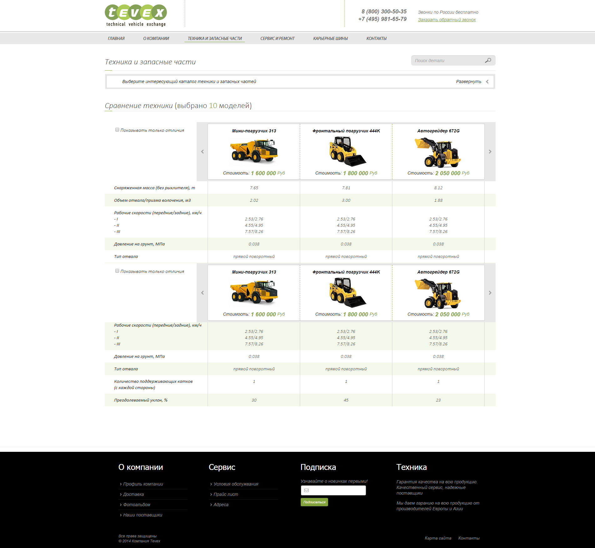
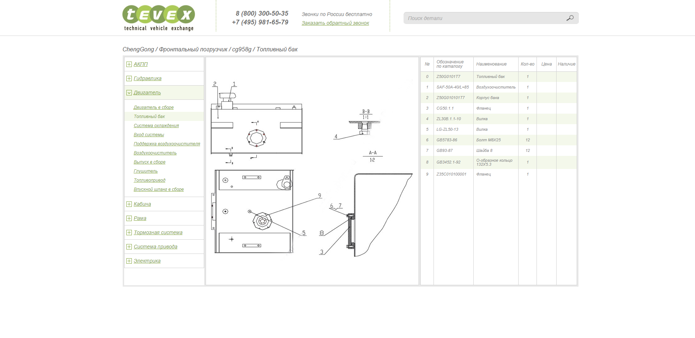
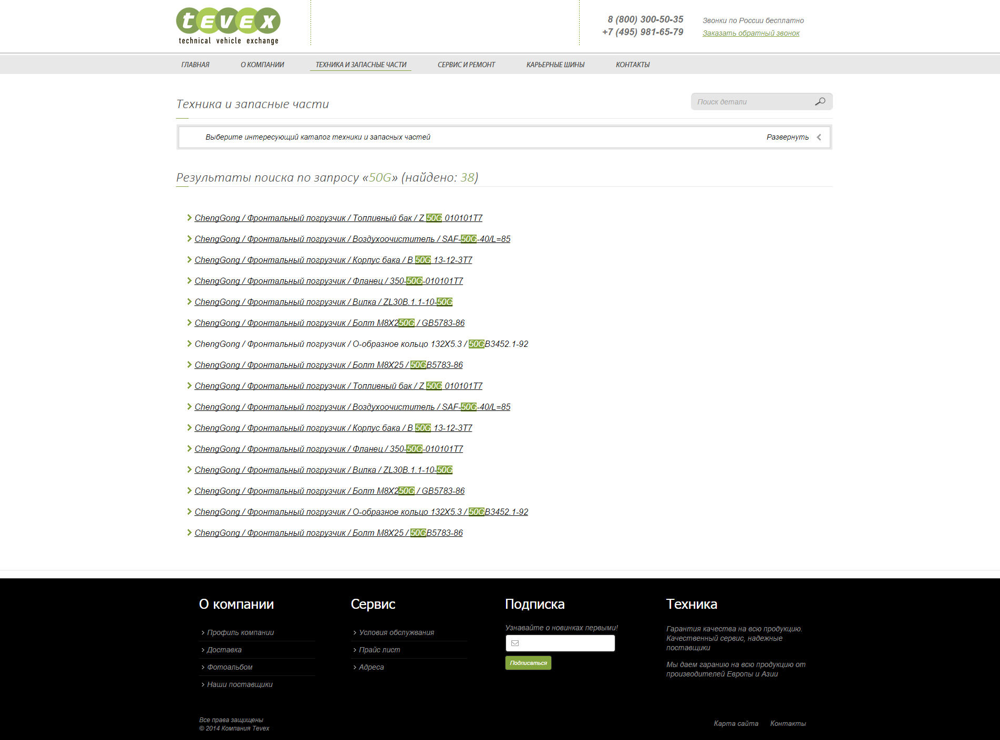

# Макет веб-сайта "Tevex"

Заказчик прислал макеты в PSD, по этим макетам сделал вёрстку.

### [Главная страница](http://enrikolabriko.github.io/tevex/dev/code/make-up/index.html "Главная страница")

### [Страница техники 1](http://enrikolabriko.github.io/tevex/dev/code/make-up/tech_1_2.html "Страница техники 1")

### [Страница техники 2](http://enrikolabriko.github.io/tevex/dev/code/make-up/tech_2.html "Страница техники 2")

### [Страница техники 3](http://enrikolabriko.github.io/tevex/dev/code/make-up/tech_3.html "Страница техники 3")

### [Страница сравнения](http://enrikolabriko.github.io/tevex/dev/code/make-up/compare.html "Страница сравнения")

### [Страница каталога](http://enrikolabriko.github.io/tevex/dev/code/make-up/cataloguesp_2.html "Страница каталога")

### [Страница поиска](http://enrikolabriko.github.io/tevex/dev/code/make-up/search_result.html "Страница поиска")

